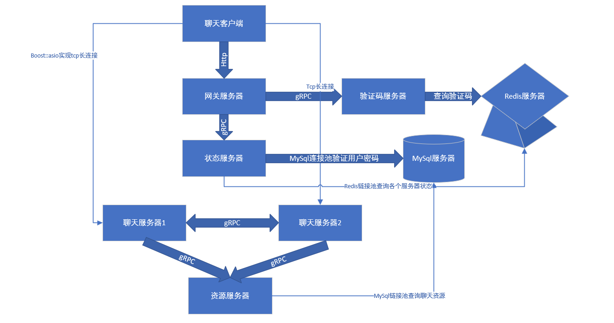

# 分布式聊天服务器

## 项目简介

本项目为C++分布式聊天服务器，包括asio异步服务器设计，beast网络库搭建http网关服务器，nodejs搭建验证码服务器，各服务间用grpc通信，聊天服务器和聊天客户端使用用boost::asio通信等。

## 项目架构

系统采用微服务拆分设计，整体结构如下：

- **GateServer** —— 网关服务
- **VerifyServer** —— 验证码服务
- **StatusServer** —— 状态服务
- **ChatServer（Server1 / Server2）** —— 聊天服务节点
- **ResourceServer** —— 资源服务
- **Redis** —— 缓存层
- **MySQL** —— 持久化数据库

------

##  GateServer（网关服务）

GateServer 是系统统一入口，负责客户端接入与注册流程。

**连接流程**

1. 客户端通过 HTTP 请求连接 GateServer
2. GateServer 通过 gRPC 调用 StatusServer 查询各 ChatServer 负载情况
3. 选择负载较低的服务器地址返回给客户端
4. 客户端使用 Boost.Asio 建立 TCP 长连接与指定 ChatServer 通信

------

**用户注册与验证码流程**

1. 客户端向 GateServer 发起注册请求
2. GateServer 调用 VerifyServer
3. VerifyServer：
   - 校验注册合法性
   - 生成验证码
   - 将验证码存入 Redis
4. 客户端携带验证码再次向 GateServer 提交注册
5. 注册成功后数据写入 MySQL

------

##  StatusServer（状态服务）

StatusServer 负责维护整个系统的运行状态：

- 记录各 ChatServer 当前连接数
- 维护服务器负载信息
- 向 GateServer 提供负载查询接口

GateServer 基于其返回结果进行服务器分配，实现动态调度。

------

##  ChatServer（聊天服务节点）

系统支持多实例部署（如 Server1、Server2）。

**功能**

- 维护客户端 TCP 长连接
- 处理消息转发
- 支持跨服务器消息通信（通过 gRPC）
- 访问 Redis 查询用户在线状态
- 访问 MySQL 进行数据持久化

------

##  ResourceServer（资源服务）

负责统一管理聊天相关资源：

- 聊天记录查询
- 文件资源访问
- 业务数据接口

ChatServer 通过 gRPC 与 ResourceServer 交互。

------

##  数据层设计

### Redis

- 验证码缓存
- 用户会话状态
- 在线状态信息
- 服务器负载状态

### MySQL

- 用户注册信息
- 用户密码校验
- 聊天记录持久化
- 用户个人资料信息

